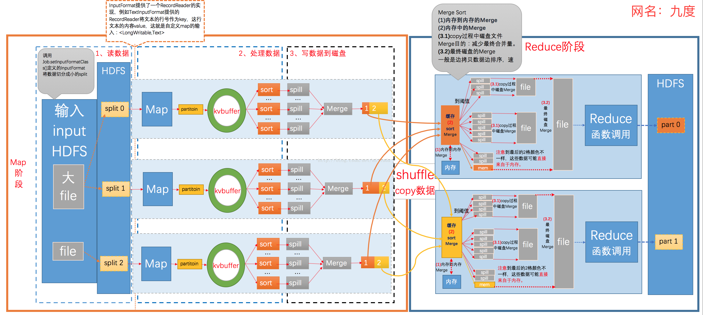

[返回目录](../README.md)
# Hive MapReduce

## MapReduce Overview

From: https://blog.csdn.net/aijiudu/article/details/72353510

## Process of MR
进度是任务完成的百分比。对于map任务，进度是已处理输入占总输入的比例。
而reduce任务，情况稍微复杂。整个reduce过程分成三部分，系统根据这三部分估计已处理的reducer输入的比例。比如，如果任务已经执行reduce一半的输入，那么任务的进度是5/6。因为已经完成复制阶段和排序阶段，每个阶段占1/3，再加上已经完成reduce阶段的一半（占1/6）。
进度报告很重要，因为它表明任务的执行情况。构成进度的所有操作如下：
1. mapper或reducer读入一条输入记录
2. mapper或reducer写入一条输出记录
3. 在一个Reporter中设置状态描述
4. 增加计数器(使用Reporter的incrCounter()方法)
5. 调用Reporter的progress()任务

*From: https://blog.csdn.net/u014313009/article/details/38045435*

## Reduce Process Details:
1. 0~33%阶段是shuffle过程，数据从 mapper -->  reducer。
2. 33~67%阶段是sort的过程，在mapper完成后才会执行。
3. 67%~100%阶段是真正的reducer程序的执行过程。
4. 如果MR在 >67%阶段卡住不动，则说明reduce一个都没有执行。可能是输入的数据量过大。
如果MR过程中reduce回退，有可能是偶发性的reduce拉取临时文件失败，或者某些节点出现意外或者task失败，出现重跑现象。