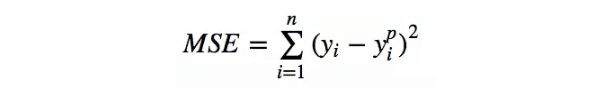
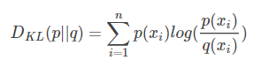
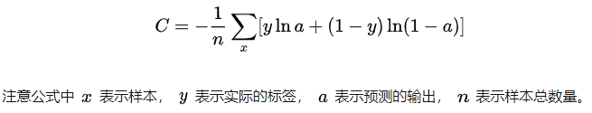
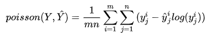
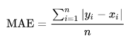
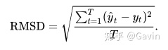

[返回目录](../README.md)
# Machine Learning
## Parameters
(1) Loss函数
* 均方方差-MSE(Mean Squared Error): 预测值和真实值差异值平方和的平均数：
   
* 相对熵-(Kullback-Leibler (KL) divergence): 真实分布与预测分布的差异
   
   **ps.P表示样本的真实分布, Q用来表示模型所预测的分布**
* 交叉熵-CrossEntropy: A和B的KL散度 = A与B的交叉熵 - A的熵。A和B的交叉熵 = A与B的KL散度 + A的熵
   
* 泊松损失-PoissonLoss:
   

(2) 评估指标
* 平均绝对误差-MAE(Mean Absolute Error): 是绝对误差的平均值，它其实是更一般形式的误差平均值
    
   **ps.yi是预测值，xi是实际值**
* MAPE(Mean Absolute Precent Error)
* 均方根误差-RMSE(Root Mean Squared Error): 预测值和实际观测之间平方差异平均值的平方根
   
   **ps.yt拔是预测值，yt是实际值**
* 准确率(Accuracy)： (TP+TN)/(TP+FN+FP+TN)
* 精确率(Precision): TP/(TP+FP)
* 召回值(Recall): TP/(TP+FN)
* ROC曲线(Receiver Operating Charateristic Curve): FP/N----TP/P
* 曲线下面积-AUC(Area Under Curve): 
* P-R曲线(Precision-Recall): p---r
* F1 score: 2pr/p+r
